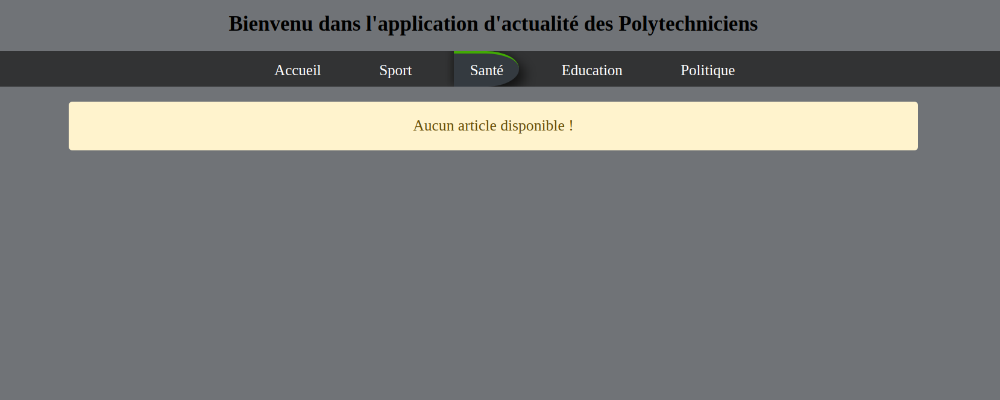

# POLYTECH NEWS
### Conception d'une application d'actualité pour les polytechniciens.

Il s’agira de concevoir une application d’actualité disposant des fonctionnalités suivantes : 

- La page d’accueil devra afficher la liste des derniers articles avec une description sommaire de chacun d’entre eux. Des boutons « suivant » et « précédent » devront permettre de parcourir les articles selon leur ancienneté.

- Le clic sur le titre d’un article devra permettre de le consulter en détail.

- On devrait avoir la possibilité de consulter les articles par catégorie.

- Trois types de profils utilisateurs devront être pris en compte :

  - Les visiteurs simples : Ils peuvent accéder à toutes les fonctionnalités applicatives liées à la consultation des articles (affichage par catégorie, etc.)
 
  - Les éditeurs : Leur rôle est de maintenir le contenu du site. De ce fait, en plus de ce que peuvent faire les visiteurs, Ils ont la possibilité, après authentification, de gérer (lister, ajouter, supprimer ou modifier) les articles et les catégories.

  - Les administrateurs sont des éditeurs qui ont la possibilité de gérer les données des utilisateurs. Ainsi, ils ont accès à toutes les fonctionnalités applicatives et peuvent donc ajouter, lister, modifier ou supprimer des utilisateurs. De même, ils sont chargés de l’ajout et de la suppression des jetons d’authentification permettant d’accéder aux services web à accès restreint.

En plus des fonctionnalités directement accessibles depuis un navigateur, l’application devra exposer un ensemble de services web afin que ses fonctionnalités métiers soient accessibles à d’autres applications. De ce fait, il vous est demandé de :

- Créer un service web SOAP permettant de :

  - Lister, ajouter, supprimer ou modifier des utilisateurs. L’accès à ce service requiert un jeton d’authentification qu’un administrateur devra au préalable générer depuis la page d’administration du site
  
  - D’authentifier un utilisateur suivant un login et un mot de passe fourni 

- Créer un service web REST permettant de :

  - Récupérer la liste de tous les articles. Cette liste devra être retournée au format XML ou JSON selon le choix de l’utilisateur
  - Récupérer la liste des articles regroupés en catégories (format XML ou JSON au choix)
  - Récupérer la liste des articles appartenant à une catégorie fournie par l’utilisateur (format XML ou JSON au choix)

En plus on devra créer une application Java (ou Python) permettant de gérer les utilisateurs. Quand l’application est lancée, elle demande à l’utilisateur son login et son mot de passe et invoque ainsi le service web d’authentification pour voir si l’utilisateur a les droits d’administration lui permettant d’agir sur les
utilisateurs. Le cas échéant, l’application devra fournir un accès complet aux fonctionnalités de gestion des utilisateurs et ce, en utilisant les services web adéquats.

## EndPoints 
- https://polytechs-news.herokuapp.com/index.php (page d'accueil)
- https://polytechs-news.herokuapp.com/auth/admin.php (page d'authentification de l'administrateur)
- https://polytechs-news.herokuapp.com/auth/editeur.php (page d'authentification de l'éditeur)
- https://polytechs-news.herokuapp.com/administrateur.php (page d'accueil de l'administrateur)
- https://polytechs-news.herokuapp.com/editeur.php (page d'accueil de l'éditeur)
- https://polytechs-news.herokuapp.com/Vue/liste-editeurs.php (Liste des éditeurs)

# Résultats 
> Page d'accueil

 

 

---

Admimnistrateur

 
 
 
 
 
 
 

----

Editeur

 
 

